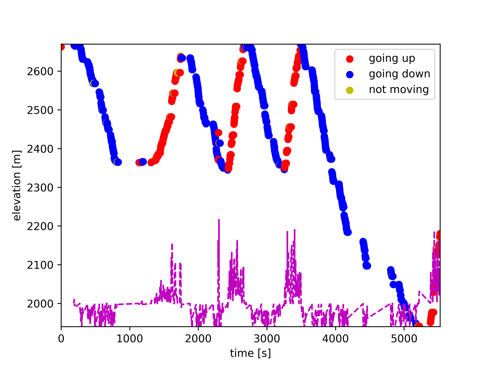

# data anyltics on gps ski tracks

> ⛷📈

## getting started

python3+

```sh
pip3 install -r requirements.txt
```

## plot.py

plot the recorded points to figure out how to properly preprocess them for unsupervised learning



## license

MIT © [Andreas Offenhäuser](http://anoff.io)
